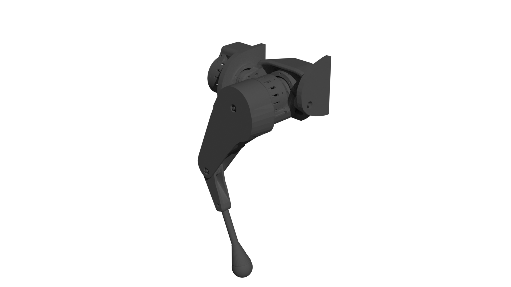

# Quadruped Robot (Only front right leg)

## 🚨 Disclaimer
Please note: I have just started to learn how to use Blender. The 3D drawings are not yet completed! Any informative comment, or participation in the project is welcome ;)

## Software
I use Blender to design my project. You can import in your Blender the "leg.blend" file.

## Actuators
For the actuators I use the opensource OpenTorque Actuator project made by [Gabrael Levine](https://hackaday.io/project/159404-opentorque-actuator).
I use more particularly the redesigned OpenTorque Actuator, by the Youtuber [Skyentific](https://www.youtube.com/c/Skyentific), then redesigned again by [RevisonNr3](https://www.thingiverse.com/thing:5155183) / [acisre](https://discourse.odriverobotics.com/t/opentorque-project-new-design/8280).
Finals Actuators STL Files are in the folder "openTorqueFiles".

# What you will need
🚨 Warning ! These are the exact components I purchased for my prototype. All prices and links are from January 10, 2022 ... They may not be current anymore ! The prices are therefore only to give you an idea.
I STILL NOT FINISHED THE PROJECT! So some components may not be correct yet.
| Piece | Number | Dimensions | Price ~ | Link (Exemple) |
|-----|:-----:|:-----:|:----:|:----:|
| Trapezoid toothed belts | 1 | 70c x 2cm | 20€ | [Amazon](https://www.amazon.fr/gp/product/B092PTVXP8/ref=ppx_yo_dt_b_asin_title_o00_s00?ie=UTF8&th=1) |
| Rubber ball | 1 | diameter: 6cm | 8€ | [Amazon](https://www.amazon.fr/gp/product/B00LSO64DY/ref=ppx_yo_dt_b_asin_title_o01_s00?ie=UTF8&th=1) |
| Steel cylinder | 3 | 8 x 100mm | 8€ | [Amazon](https://www.amazon.fr/gp/product/B081JNJPV2/ref=ppx_yo_dt_b_asin_title_o02_s00?ie=UTF8&psc=1) |
| Steel cylinder | 1 | 3 x 28mm | 1€ | [Amazon](https://www.amazon.fr/dp/B07MBNXDT3?psc=1&smid=A38WCF64ZZVDKC&ref_=chk_typ_imgToDp) |
| Ball bearing | 6 | 70 x 90 x 10mm | 57€ | [Aliexpress](https://fr.aliexpress.com/item/763194187.html?spm=a2g0o.9042311.0.0.2f326c37LDlLac) |
| Ball bearing | 18 | 15 x 28 x 7mm  | 20€ | [Aliexpress](https://fr.aliexpress.com/item/900706083.html?spm=a2g0o.9042311.0.0.2f326c37LDlLac) |
| Ball bearing | 4 | 8 x 22 x 7mm | 14€ | [Aliexpress](https://fr.aliexpress.com/item/4000984095586.html?spm=a2g0o.productlist.0.0.61861a5d8KFBDv&algo_pvid=ec68e3f1-2c37-41c1-afe2-a78161561c80&aem_p4p_detail=20220113064419712349172646800007422009&algo_exp_id=ec68e3f1-2c37-41c1-afe2-a78161561c80-9&pdp_ext_f=%7B%22sku_id%22%3A%2210000013194931970%22%7D&pdp_pi=-1%3B3.72%3B-1%3B-1%40salePrice%3BEUR%3Bsearch-mainSearch) |
| Screw (flat head) | 12 | M4 x 10mm | 2€ | [Aliexpress](https://fr.aliexpress.com/item/1005003411992910.html?spm=a2g0o.9042311.0.0.2f326c37LDlLac) |
| Screw (flat head) | 42 | M3 x 20mm | 3€ | [Aliexpress](https://fr.aliexpress.com/item/4001072025844.html?spm=a2g0o.9042311.0.0.2f326c37LDlLac) |
| Screw (flat head) | 30 | M3 x 10mm | 3€ | [Aliexpress](https://fr.aliexpress.com/item/4001072025844.html?spm=a2g0o.9042311.0.0.2f326c37LDlLac) |
| Screw (socket head) | 12 | M4 x 20mm | 3€ | [Aliexpress](https://fr.aliexpress.com/item/1005001975621423.html?spm=a2g0o.9042311.0.0.2f326c37LDlLac) |
| Screw (socket head) | 57 | M3 x 20mm | 4€ | [Aliexpress](https://fr.aliexpress.com/item/1005001975621423.html?spm=a2g0o.9042311.0.0.2f326c37LDlLac) |
| Screw (socket head) | 12 | M2.5 x 10mm | 1.5€ | [Aliexpress](https://fr.aliexpress.com/item/1005001975621423.html?spm=a2g0o.9042311.0.0.2f326c37LDlLac) |
| Nut | 30 | M4 | 1.5€ | [Aliexpress](https://fr.aliexpress.com/item/32798773566.html?spm=a2g0o.9042311.0.0.2f326c37LDlLac) |
| Nut | 96 | M3 | 1.5€ | [Aliexpress](https://fr.aliexpress.com/item/32798773566.html?spm=a2g0o.9042311.0.0.2f326c37LDlLac) |
| Nut | 12 | M2.5 | 3€ | [Aliexpress](https://fr.aliexpress.com/item/32798773566.html?spm=a2g0o.9042311.0.0.2f326c37LDlLac) |
| Power supply | 1 | 1500W / 24V 62.5a | 80€ | [Aliexpress](https://fr.aliexpress.com/item/4000918005199.html?spm=a2g0o.9042311.0.0.2f326c37LDlLac) |
| Magnetic rotation encoder | 3 | 14-bit | 57€ | [Aliexpress](https://fr.aliexpress.com/item/1005001688635554.html?spm=a2g0o.9042311.0.0.2f326c37LDlLac) |
| Engine controler | 2 | 2 motors | 170€ | [Aliexpress](https://fr.aliexpress.com/item/1005002349959313.html?spm=a2g0o.9042311.0.0.2f326c37LDlLac) |
| Brushless motor | 3 | W9235 (X8318S) | 170€ | [Aliexpress](https://fr.aliexpress.com/item/4001103601935.html?spm=a2g0o.9042311.0.0.2f326c37LDlLac) |
| Cables |  | 2m | 1€ | [Aliexpress](https://fr.aliexpress.com/item/1005001876779326.html?spm=a2g0o.9042311.0.0.20926c37dbOLOt) |

**TOTAL : ~ 628 EUR** *(~ 720 USD)*   
***PLA, Nylon, and screws for the leg are missing in the table!***

So for around 630 € you can fully do this leg. If you want to do others, be aware that some components can be used for several legs ...
For 4 legs, I think it could cost 550 euros per leg. However this fast calcul does not include the price of the tools, the battery (for autonomous robot), and the raspberry pi (for example).

# TO DO LIST :
- [x] Import the Opentorque remaked project in my 3D plan.
- [x] Design the leg in 3D.
- [x] Make it printable with 3D printer.
- [X] Print all
- [ ] Assemble it. (Aslmost done)   
- [ ] Correct the latest mistakes.
- [ ] Write the assembly manual.
- [ ] Develop sofware to move the leg.
